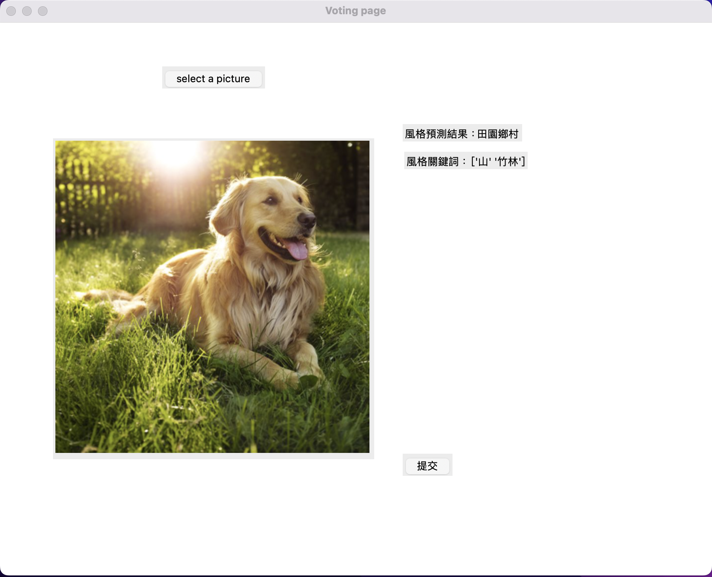

# Automatic Generation of Classical Chinese Poetry

* **Research topic:** [Automatic Generation of Classical Chinese Poetry Based on Image and Color of Paintings]("http://search.taai.org.tw/paper/2020/0/%E5%9F%BA%E6%96%BC%E5%9C%96%E5%83%8F%E7%90%86%E8%A7%A3%E8%88%87%E8%89%B2%E5%BD%A9%E6%84%8F%E8%B1%A1%E7%94%B1%E7%95%AB%E4%BD%9C%E7%94%9F%E6%88%90%E8%A9%A9%E6%96%87%E4%B9%8B%E7%B3%BB%E7%B5%B1.pdf")
* **Author:** Mei-Ren Ke, An-Ting Hsieh, I-Cheng Yeh

## To-Do
* [ ] 導入WMPoetry
* [ ] 寫readme中的features, contribution等等

## Quick Setup (Basic Usage)
### 1. Build a virtual environment (Anaconda 4.7.12):
``` 
conda create --name myenv python=3.8.13 
conda activate myenv
conda install pandas
conda install scikit-learn
conda install pillow
conda install opencv
```

### 2. Execute: 
```
python style_result_page.py
```



* 視窗出現後，按"select a picture"選圖片
* 按"提交"之後，會開始預測同個資料夾內下一張圖片的風格

## Contact
Feel free to reach me at any time.
<pre><code>Email: meirenke4@gmail.com
LinkedIn: https://www.linkedin.com/in/mei-ren-ke-7136641a5/ </code></pre>